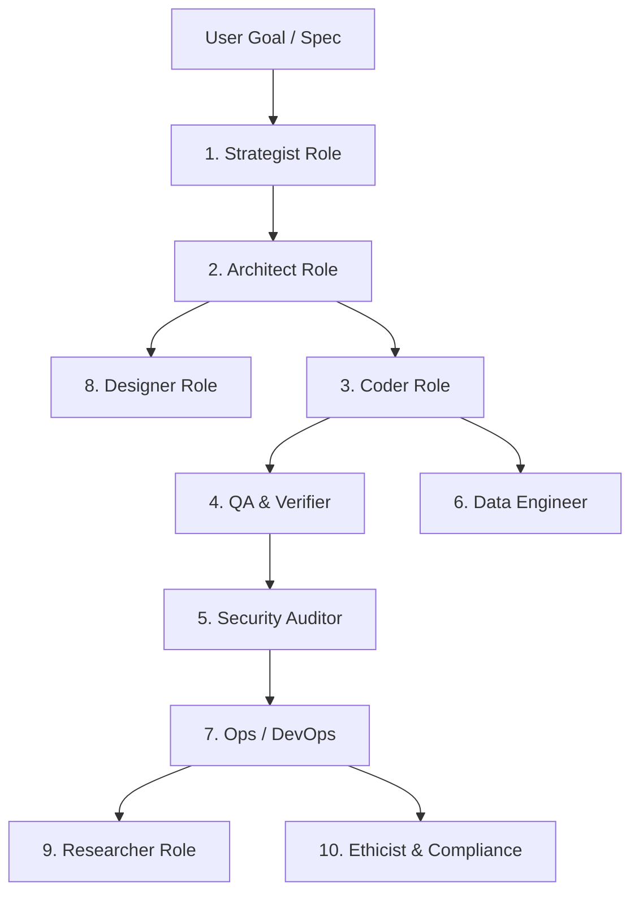

## The 10 Specialized AI Roles

  

    ROLE 01
    <h3 class="text-lg font-bold text-ink mt-1">Strategist</h3>
    
Classifies incoming requests, sets operational boundaries, and determines execution path complexity.

  

  

    ROLE 02
    <h3 class="text-lg font-bold text-ink mt-1">Architect</h3>
    
Designs data schemas, module boundaries, system blueprints, and topological dependency order.

  

  

    ROLE 03
    <h3 class="text-lg font-bold text-ink mt-1">Coder</h3>
    
Generates production source code strictly abiding by AST Project DNA interfaces.

  

  

    ROLE 04
    <h3 class="text-lg font-bold text-ink mt-1">QA & Verifier</h3>
    
Executes syntax compilation, import resolution checks, and test runner routines.

  

  

    ROLE 05
    <h3 class="text-lg font-bold text-ink mt-1">Security Auditor</h3>
    
Audits code for injection risks, credential leaks, and permission boundary violations.

  

  

    ROLE 06
    <h3 class="text-lg font-bold text-ink mt-1">Data Engineer</h3>
    
Manages database queries, migrations, ORM models, and data transfer pipelines.

  

  

    ROLE 07
    <h3 class="text-lg font-bold text-ink mt-1">Ops / DevOps</h3>
    
Manages container sandboxing, cloud deployment pipelines, and environment variables.

  

  

    ROLE 08
    <h3 class="text-lg font-bold text-ink mt-1">Designer</h3>
    
Enforces UI design tokens, layout consistency, responsive breakpoints, and glassmorphism styling.

  

  

    ROLE 09
    <h3 class="text-lg font-bold text-ink mt-1">Researcher</h3>
    
Fetches third-party API documentation, library references, and dependency version specs.

  

  

    ROLE 10
    <h3 class="text-lg font-bold text-ink mt-1">Ethicist & Compliance</h3>
    
Validates data privacy rules, SAIF compliance, open-source licensing, and audit logging.

  

