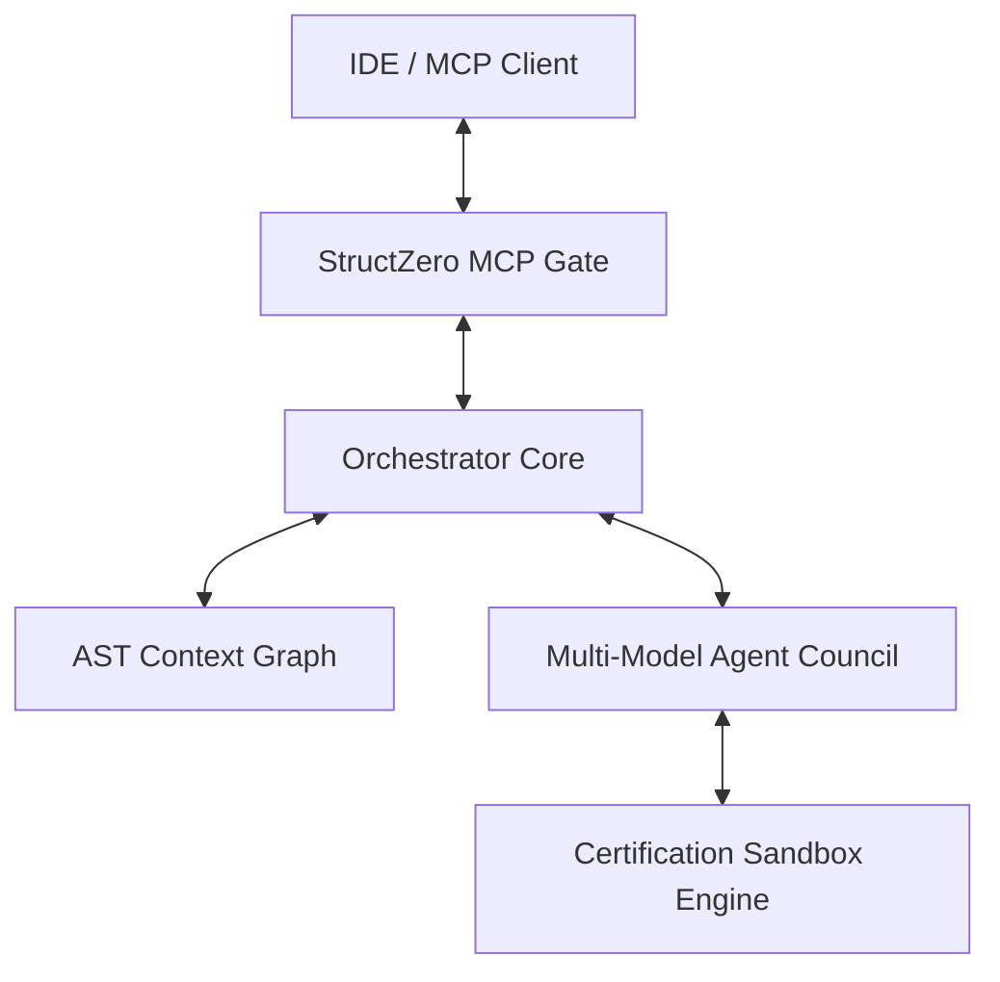

## System Boundaries

```mermaid
graph TD
    Client[IDE / MCP Client] <--> API[StructZero MCP Gate]
    API <--> Orch[Orchestrator Core]
    Orch <--> DNA[AST Context Graph]
    Orch <--> Council[Multi-Model Agent Council]
    Council <--> Gate[Certification Sandbox Engine]
```
