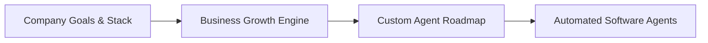

## Business Analysis Flow

```mermaid
graph LR
    CompanyInput[Company Goals & Stack] --> Analyzer[Business Growth Engine]
    Analyzer --> RoadmapRec[Custom Agent Roadmap]
    RoadmapRec --> AgentDeploy[Automated Software Agents]
```
