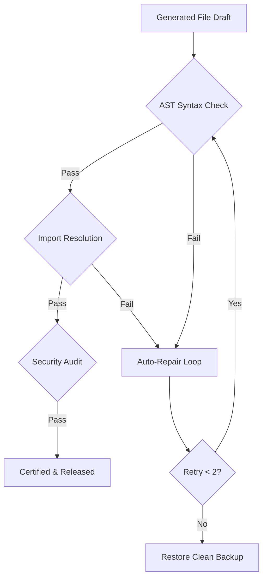

## Certification Pipeline

```mermaid
flowchart TD
    FileGenerated[Generated File Draft] --> SyntaxCheck{AST Syntax Check}
    SyntaxCheck -- Pass --> ImportCheck{Import Resolution}
    SyntaxCheck -- Fail --> Repair[Auto-Repair Loop]
    ImportCheck -- Pass --> SecurityCheck{Security Audit}
    ImportCheck -- Fail --> Repair
    Repair --> RetryCheck{Retry < 2?}
    RetryCheck -- Yes --> SyntaxCheck
    RetryCheck -- No --> Restore[Restore Clean Backup]
    SecurityCheck -- Pass --> Certified[Certified & Released]
```
