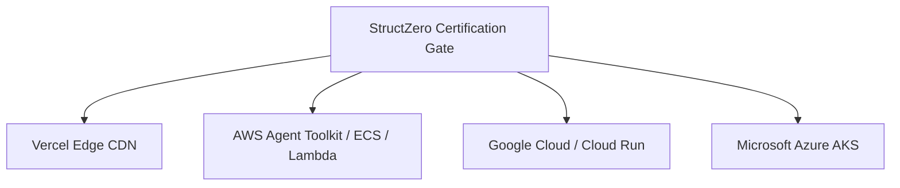

## Supported Cloud Targets

```mermaid
graph TD
    SZ[StructZero Certification Gate] --> Vercel[Vercel Edge CDN]
    SZ --> AWS[AWS Agent Toolkit / ECS / Lambda]
    SZ --> GCP[Google Cloud / Cloud Run]
    SZ --> Azure[Microsoft Azure AKS]
```
