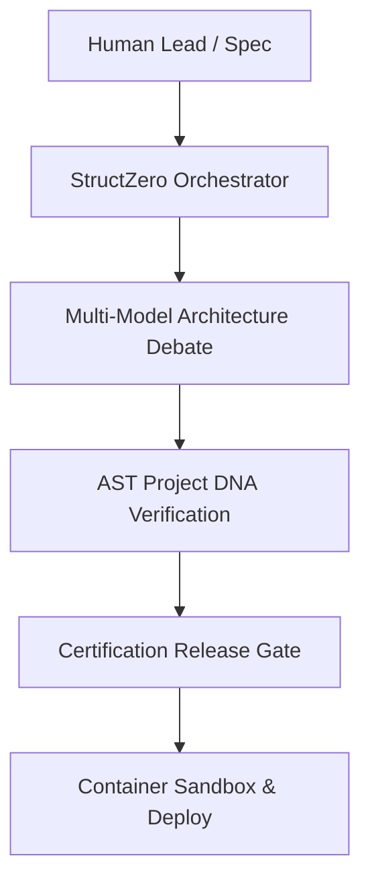

## Our Mission

Modern software development requires rigorous architecture design, multi-model review, and verification. Most AI tools attempt to replace developers with single-prompt chatbot scripts.

**StructZero takes the opposite approach**: we build an **AI Software Engineering Platform** that operates like a top-tier engineering department — coordinating architects, reviewers, security specialists, and QA roles into a unified council.

## Core Operating Principles

1. **Architecture Before Code**: No code is generated until multi-model consensus is reached on data models and interfaces.
2. **Every File Certified**: Before any file reaches disk, AST syntax parsers and import paths are tested.
3. **IDE Agnostic**: Operates via standard Model Context Protocol (MCP) so you can keep using Cursor, VS Code, Zed, or Claude Code.
