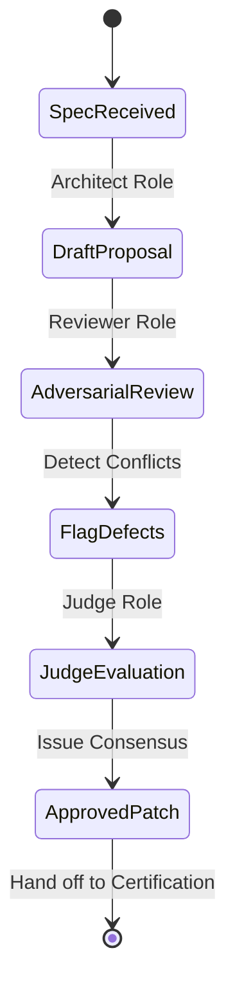

## The 7-Step Debate Sequence

```mermaid
stateDiagram-v2
    [*] --> SpecReceived
    SpecReceived --> DraftProposal: Architect Role
    DraftProposal --> AdversarialReview: Reviewer Role
    AdversarialReview --> FlagDefects: Detect Conflicts
    FlagDefects --> JudgeEvaluation: Judge Role
    JudgeEvaluation --> ApprovedPatch: Issue Consensus
    ApprovedPatch --> [*]: Hand off to Certification
```
