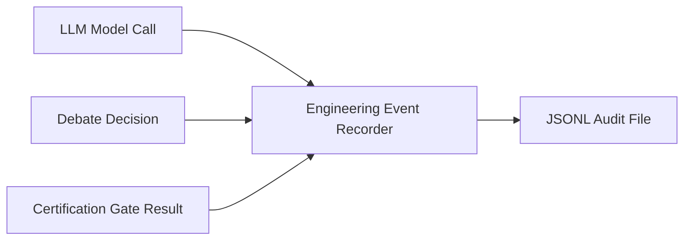

## Event Logging Model

```mermaid
graph LR
    ModelCall[LLM Model Call] --> LogStream[Engineering Event Recorder]
    DebateStep[Debate Decision] --> LogStream
    GateCheck[Certification Gate Result] --> LogStream
    LogStream --> JSONL[JSONL Audit File]
```
