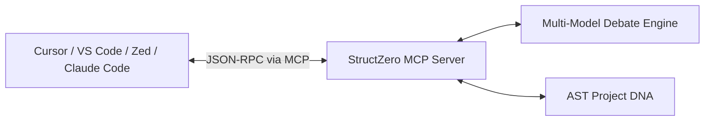

## MCP Architecture

```mermaid
graph LR
    Editor[Cursor / VS Code / Zed / Claude Code] <-->|JSON-RPC via MCP| MCPServer[StructZero MCP Server]
    MCPServer <--> DebateEngine[Multi-Model Debate Engine]
    MCPServer <--> ASTGraph[AST Project DNA]
```
