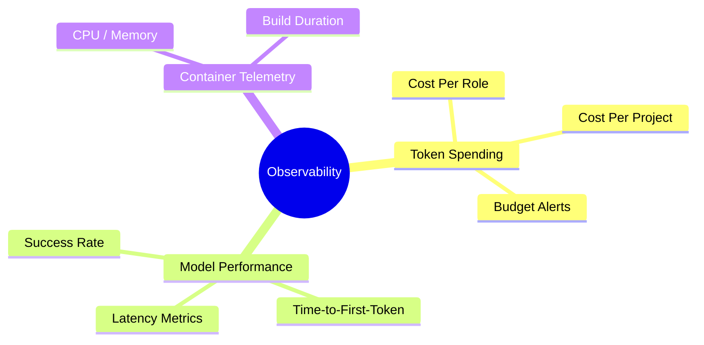

## Observability Dashboard Metrics

```mermaid
mindmap
  root((Observability))
    Token Spending
      Cost Per Role
      Cost Per Project
      Budget Alerts
    Model Performance
      Latency Metrics
      Time-to-First-Token
      Success Rate
    Container Telemetry
      CPU / Memory
      Build Duration
```
