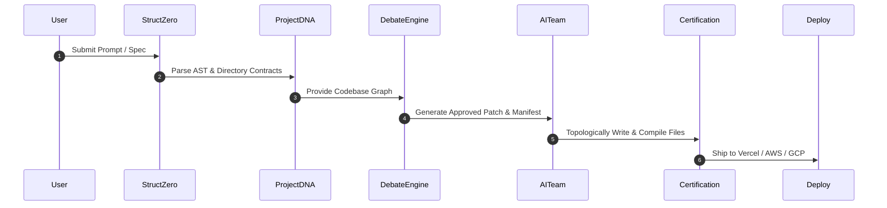

## Platform Workflow

```mermaid
sequenceDiagram
    autonumber
    User->>StructZero: Submit Prompt / Spec
    StructZero->>ProjectDNA: Parse AST & Directory Contracts
    ProjectDNA->>DebateEngine: Provide Codebase Graph
    DebateEngine->>AITeam: Generate Approved Patch & Manifest
    AITeam->>Certification: Topologically Write & Compile Files
    Certification->>Deploy: Ship to Vercel / AWS / GCP
```
