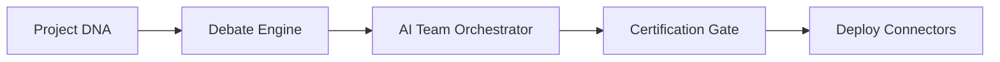

## Product Pillars

StructZero unifies five core engines into one seamless platform:

### 1. Project DNA Context Engine
Extracts AST syntax trees, route topologies, and exported symbols to ground generation in reality.

### 2. Multi-Model Debate Engine
Models independently critique architecture proposals to uncover scale bottlenecks and security flaws.

### 3. Certification & Quality Gates
Runs syntax compilation, import resolution, and security checks before code reaches your repository.
