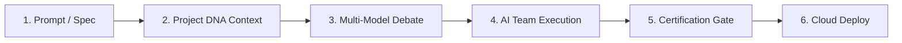

## Product Architecture & Lifecycle

StructZero unifies five core engines into one seamless engineering platform:

### 1. Project DNA Context Engine
Extracts Abstract Syntax Trees (AST), route topologies, and exported module symbols to ground code generation in reality, preventing broken imports.

### 2. Multi-Model Debate Engine
Assigns independent LLM models (Gemini, Claude, DeepSeek) to opposing roles (Architect, Reviewer, Judge) to critique designs and resolve bottlenecks before writing code.

### 3. Named-Role AI Team Orchestration
Divides cognitive workload across 10 specialized roles including Strategist, Architect, Coder, QA, Security Auditor, Data Engineer, Ops, Designer, Researcher, and Compliance.

### 4. Automated Certification Release Gate
Executes pre-flight AST compilation checks, import resolution, and automated repair loops before any file is committed to your repository.

### 5. IDE-Agnostic MCP Server & Cloud Connectors
Exposes StructZero's engineering council to any editor via Model Context Protocol (MCP) and ships code via Vercel, AWS, GCP, and Azure connectors.
