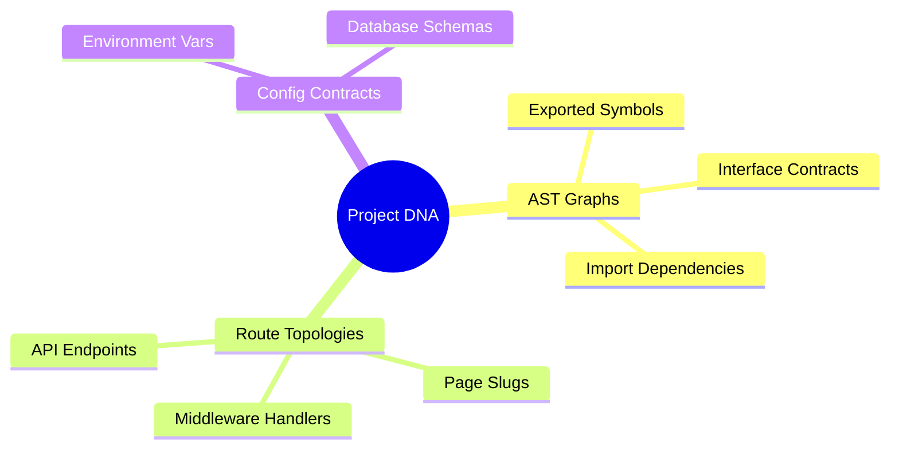

## What Project DNA Extracts

```mermaid
mindmap
  root((Project DNA))
    AST Graphs
      Exported Symbols
      Interface Contracts
      Import Dependencies
    Route Topologies
      API Endpoints
      Page Slugs
      Middleware Handlers
    Config Contracts
      Environment Vars
      Database Schemas
```
