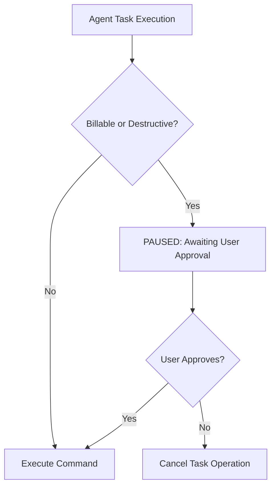

## Approval Guardrail Workflow

```mermaid
flowchart TD
    Task[Agent Task Execution] --> Check{Billable or Destructive?}
    Check -- Yes --> Pause[PAUSED: Awaiting User Approval]
    Pause --> UserChoice{User Approves?}
    UserChoice -- Yes --> Execute[Execute Command]
    UserChoice -- No --> Abort[Cancel Task Operation]
    Check -- No --> Execute
```
