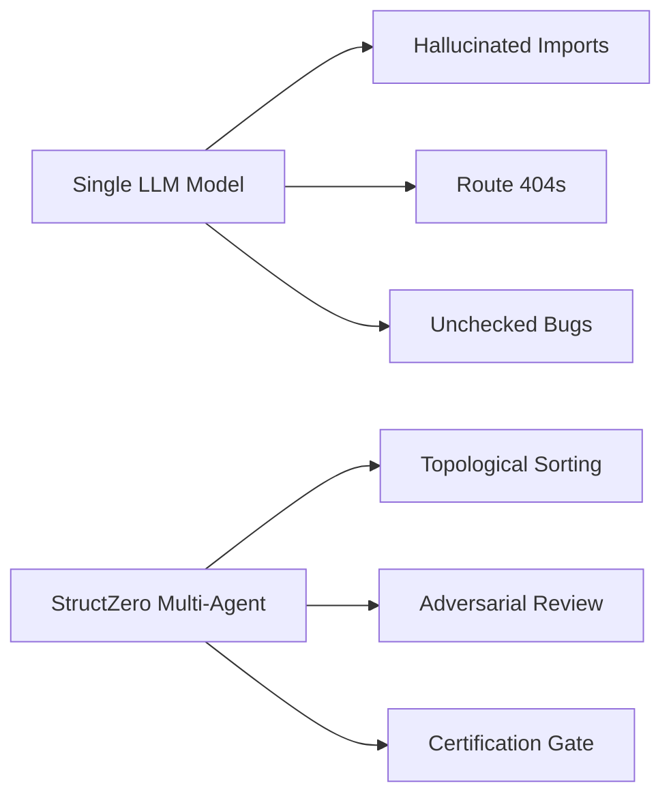

## The Structural Flaw in Current AI Coding Tools

When a single LLM attempts to generate complex multi-file applications simultaneously:
- It guesses what dependent files will export before they exist.
- It mixes CommonJS and ESM module syntax.
- Hardcoded secrets and command injection flaws go unnoticed.

