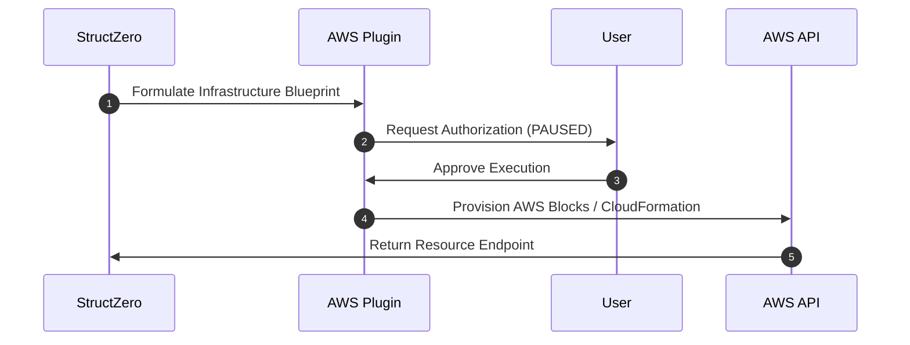

## Technical Overview

```mermaid
sequenceDiagram
    autonumber
    StructZero->>AWS Plugin: Formulate Infrastructure Blueprint
    AWS Plugin->>User: Request Authorization (PAUSED)
    User->>AWS Plugin: Approve Execution
    AWS Plugin->>AWS API: Provision AWS Blocks / CloudFormation
    AWS API->>StructZero: Return Resource Endpoint
```
