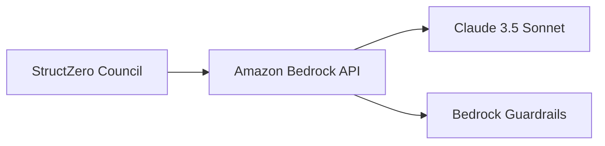

## Bedrock Architecture

```mermaid
graph LR
    Orchestrator[StructZero Council] --> Bedrock[Amazon Bedrock API]
    Bedrock --> Claude[Claude 3.5 Sonnet]
    Bedrock --> Guardrails[Bedrock Guardrails]
```
