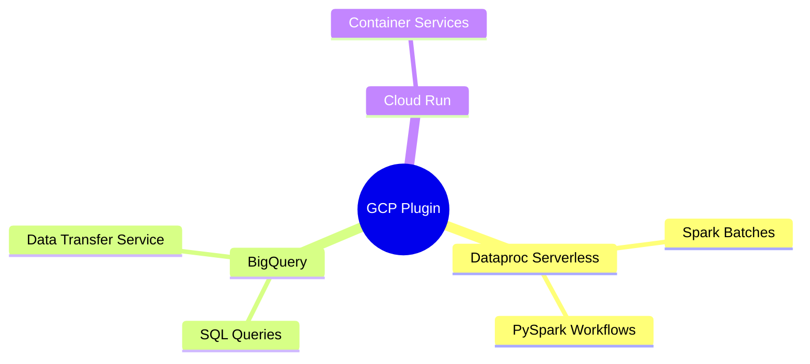

## GCP Capabilities Graph

```mermaid
mindmap
  root((GCP Plugin))
    Dataproc Serverless
      Spark Batches
      PySpark Workflows
    BigQuery
      SQL Queries
      Data Transfer Service
    Cloud Run
      Container Services
```
