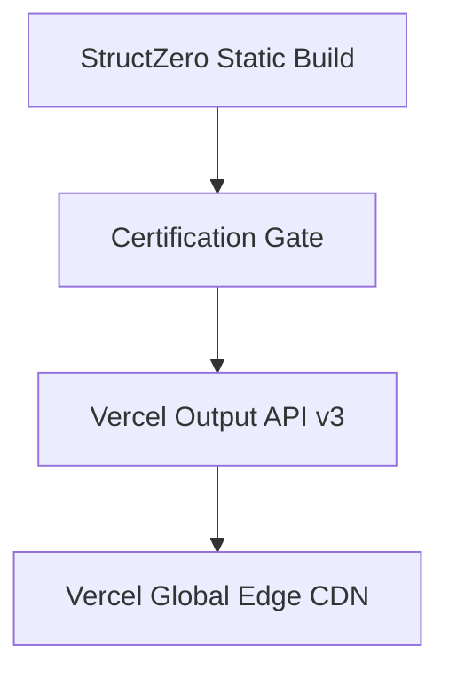

## Deployment Architecture

```mermaid
graph TD
    Build[StructZero Static Build] --> Gate[Certification Gate]
    Gate --> Output[Vercel Output API v3]
    Output --> Edge[Vercel Global Edge CDN]
```
